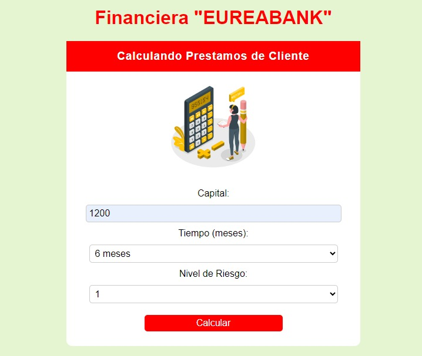
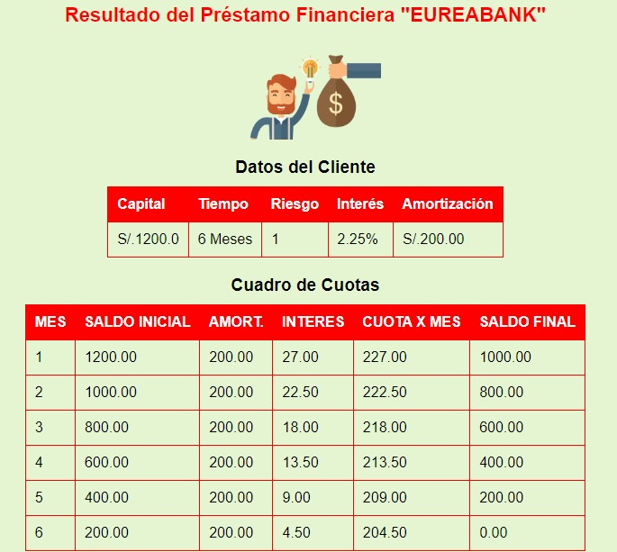
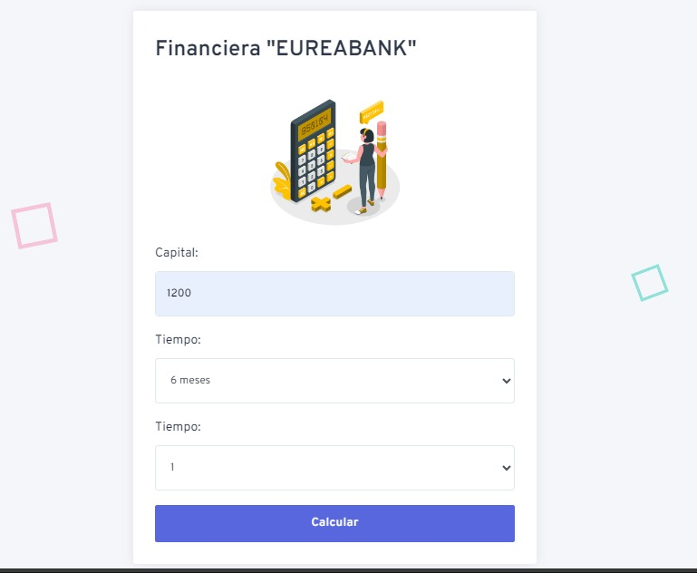
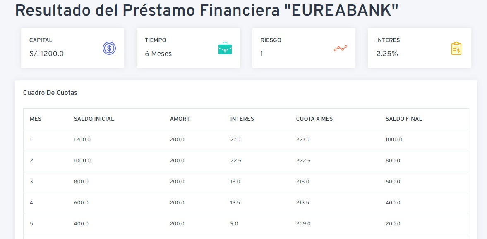

# Aplicación Web En Java Financiera

La institución financiera "EUREABANK" otorga préstamos a personas naturales

Se Desarrollo dos aplicaciones web que permita Calcular el cuadro de cuotas de un préstamo.

## Versión de la App Web Java

 - [Version 1: SERVLET | JSP | MVC | CSS PURO ](https://github.com/vallegrande/AS231S3_T11-lab/tree/main/App_1_Financiera)
 - [Version 2: SERVLET |JSP| MVC | BOOTSTRAP | JSTL ](https://github.com/vallegrande/AS231S3_T11-lab/tree/main/App_2_Financiera)
 
## Uso de Tecnología

**Client:** Jsp, Bootstrap para la interfaz de usuario en el lado del cliente.

**Server:**  Java EE con el patrón MVC (Modelo-Vista-Controlador) y JSTL (JSP Standard Tag Library) para la lógica empresarial y las vistas dinámicas.

## Versión 1

## Versión 2

## 🚀 Desarrolladores

Dev: [MichaellIbarra](https://github.com/MichaellIbarra)

